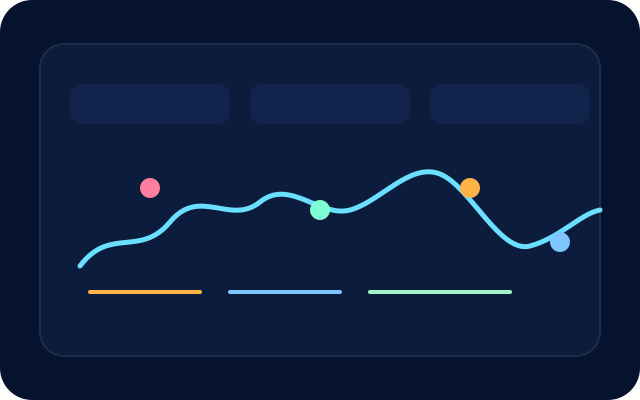

# Shreya De · Portfolio

Next.js (App Router) experience showcasing Shreya De&rsquo;s work as a product-focused software engineer. The site blends a narrative hero, project highlights, quantified skills, and an API-backed contact form while remaining production-ready for Google Cloud Run.



## Highlights
- **Hero & navigation:** Sticky navigation, hero story, calls-to-action, and metric cards anchor the value proposition.
- **Projects & awards:** Three fully documented case studies plus a recognition rail with clear tech stacks, links, and imagery.
- **Skills with proficiency:** Visual progress indicators and categorized toolsets communicate technical depth at a glance.
- **Dynamic contact form:** Client component posts to a Next.js API route, with optimistic UI states, email + LinkedIn fallbacks.
- **Responsive polish:** Tailwind-powered layout tested at 360px, 768px, and 1280px breakpoints, ensuring mobile/tablet/desktop support.
- **Cloud Run-ready:** Dockerfile + instructions to build, push, and deploy a containerized Next.js server to GCP.

## Tech Stack
- **Framework:** Next.js 13 App Router + React 18 + TypeScript
- **Styling:** Tailwind CSS with custom design tokens and `@tailwindcss/forms`
- **Deployment:** Docker, Google Cloud Run (HTTP on port 8080)

## Getting Started
Requirements: Node.js 16.14+ (or 18+), npm.

```bash
npm install
npm run dev
```
Open `http://localhost:3000` and edit `src/app/page.tsx` or other files to iterate.

### Quality & Tests
- `npm run lint` &mdash; ESLint (Next.js config) to keep the codebase healthy.
- Responsive spot-checks: use your browser devtools to test ~360px, 768px, and ≥1280px widths (already validated once while building).

### Production Build
```bash
npm run build
npm start  # serves the compiled app on port 3000 (respects PORT env)
```

## Containerization & Cloud Run
A multi-stage Dockerfile is included.

```bash
docker build -t portfolio:latest .
docker run -p 8080:8080 portfolio:latest
```

### Automated Cloud Run Deploy (Cloud Build)
Use `cloudbuild.yaml` for an end-to-end build + deploy pipeline:

```bash
gcloud builds submit \
  --config cloudbuild.yaml \
  --substitutions _REGION=us-central1,_REPOSITORY=portfolio,_SERVICE_NAME=shreya-portfolio
```
Adjust the substitutions (region, Artifact Registry repo, and service name) to match your project. Cloud Build will build the Docker image, push it to Artifact Registry, and deploy the latest commit to Cloud Run automatically.

### Deploying to Google Cloud Run
1. Configure gcloud, set your project, and enable Artifact Registry + Cloud Run:
   ```bash
   gcloud config set project YOUR_PROJECT_ID
   gcloud auth configure-docker
   ```
2. Build and push the image:
   ```bash
   gcloud builds submit --tag REGION-docker.pkg.dev/YOUR_PROJECT_ID/portfolio/portfolio:v1
   ```
3. Deploy to Cloud Run:
   ```bash
   gcloud run deploy shreya-portfolio \
     --image REGION-docker.pkg.dev/YOUR_PROJECT_ID/portfolio/portfolio:v1 \
     --platform managed \
     --region REGION \
     --allow-unauthenticated \
     --port 8080
   ```
4. Record the HTTPS URL Cloud Run returns and update DNS or share directly.

> Tip: add `--set-env-vars NODE_ENV=production` or secrets as needed. Next.js honors the `PORT` variable already set in the Dockerfile (8080).

## GitHub Workflow
1. Initialize or reuse git: `git init && git add . && git commit -m "feat: launch portfolio"`.
2. Create a GitHub repo (via the UI or `gh repo create`) and add it as the remote: `git remote add origin git@github.com:YOUR_USER/portfolio.git`.
3. Push: `git push -u origin main`.

## Contact Form Notes
- Defined in `src/components/ContactForm.tsx` with optimistic UI feedback states.
- API handler lives at `src/app/api/contact/route.ts`; it currently logs submissions server-side. Wire it to email, Firestore, etc., by swapping the placeholder logic.

## Project Structure
```
src/
  app/
    api/contact/route.ts   # Next.js API route
    layout.tsx             # Fonts + metadata + global styles
    page.tsx               # Portfolio sections
  components/ContactForm.tsx
public/images/             # Custom SVG artwork for projects & hero
Dockerfile
```

Ship it ✨
